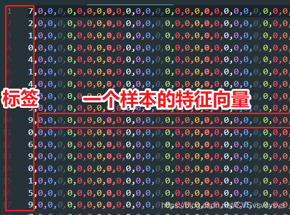

## 在 M2DOCK 上使用 numpy + mnist 训练模型导出导入验证的教程

测试集位于 mnist_test.csv ；

训练集位于 mnist_train.zip (csv格式超过可上传最大值）；

code包括神经网络模型和用测试、训练数据跑出的最优模型；

数据集：MINIST；

不可使用 pytorch，tensorflow 等 python package，可以使用numpy；

## 准备数据集

CSV 文件内容介绍：(https://blog.csdn.net/CVSvsvsvsvs/article/details/85127096)



更多数据集可以自己寻找或制作：[制作minist格式的图像数据集](https://blog.csdn.net/vertira/article/details/122326362)

## 在板子上训练

这里演示十分钟即可在 wiki.sipeed.com/m2dock 上训练 mnist 模型，精简数据集为 100 测试 10 验证，可快速体验效果。

00_demo.ipynb 01_min_train.py 02_val_mnist.py

完整的演示过程 00_demo.ipynb 其他脚本可以直接在板子依次运行。

使用 numpy 训练要打开 numpy.random 模块

`rm -rf /usr/lib/python3.8/site-packages/numpy/random/__init__.py`

想恢复就用

`touch /usr/lib/python3.8/site-packages/numpy/random/__init__.py`

该功能只影响开机加载 numpy 的速度以及内存占用，因为 maixpy3 底层是应用了 numpy 进行部分后处理转换的，所以会发现部署 AI 应用的时候开机速度很慢。


```bash

cd NeuralNetwork

adb push mnist_test_10.csv mnist_train_100.csv 01_min_train.py 02_val_mnist.py /root

adb push resc /root/resc

adb shell

rm -rf /usr/lib/python3.8/site-packages/numpy/random/__init__.py

cd /root/

python 01_min_train.py # 训练模型并导出

python 02_val_mnist.py # 加载模型并验证

```

运行结果如下：

```bash
juwan@juwan-n85-dls:~$ cd NeuralNetwork
juwan@juwan-n85-dls:~/NeuralNetwork$
juwan@juwan-n85-dls:~/NeuralNetwork$ adb push mnist_test_10.csv mnist_train_100.csv 01_min_train.py 02_val_mnist.py /root
mnist_test_10.csv: 1 file pushed. 3.4 MB/s (18006 bytes in 0.005s)
mnist_train_100.csv: 1 file pushed. 4.2 MB/s (182023 bytes in 0.041s)
01_min_train.py: 1 file pushed. 2.0 MB/s (4940 bytes in 0.002s)
02_val_mnist.py: 1 file pushed. 2.1 MB/s (3972 bytes in 0.002s)
4 files pushed. 3.8 MB/s (208941 bytes in 0.053s)
juwan@juwan-n85-dls:~/NeuralNetwork$
juwan@juwan-n85-dls:~/NeuralNetwork$ adb push resc /root/resc
resc/: 6 files pushed. 3.6 MB/s (13866458 bytes in 3.723s)
juwan@juwan-n85-dls:~/NeuralNetwork$
juwan@juwan-n85-dls:~/NeuralNetwork$ adb shell


BusyBox v1.27.2 () built-in shell (ash)

------run profile file-----
 _   .-')      ('-.            ) (`-.
( '.( OO )_   ( OO ).-.         ( OO ).
 ,--.   ,--.) / . --. /  ,-.-')(_/.  \_)-.
 |   `.'   |  | \-.  \   |  |OO)\  `.'  /
 |         |.-'-'  |  |  |  |  \ \     /\
 |  |'.'|  | \| |_.'  |  |  |(_/  \   \ |
 |  |   |  |  |  .-.  | ,|  |_.' .'    \_)
 |  |   |  |  |  | |  |(_|  |   /  .'.  \
 `--'   `--'  `--' `--'  `--'  '--'   '--'
   __   _
  / /  (_)__  __ ____ __ ------------------------
 / /__/ / _ \/ // /\ \ /  sipeed.com (Neptune)
/____/_/_//_/\_,_//_\_\  ------------------------

root@sipeed:/#
root@sipeed:/# rm -rf /usr/lib/python3.8/site-packages/numpy/random/__init__.py
root@sipeed:/#
root@sipeed:/# cd /root/
root@sipeed:~#
root@sipeed:~# python 01_min_train.py # 训练模型并导出
(100, 785)
(10, 785)
准确度50.00%
隐藏层节点数512,学习率0.100000,准确度60.00%
隐藏层节点数512,学习率0.200000,准确度50.00%
隐藏层节点数512,学习率0.300000,准确度60.00%
隐藏层节点数256,学习率0.100000,准确度60.00%
隐藏层节点数256,学习率0.200000,准确度60.00%
隐藏层节点数256,学习率0.300000,准确度50.00%
隐藏层节点数128,学习率0.100000,准确度60.00%
隐藏层节点数128,学习率0.200000,准确度60.00%
隐藏层节点数128,学习率0.300000,准确度60.00%
第1次训练,准确度50.00%
第2次训练,准确度60.00%
第3次训练,准确度70.00%
第4次训练,准确度70.00%
第5次训练,准确度70.00%
第6次训练,准确度70.00%
第7次训练,准确度70.00%
第8次训练,准确度70.00%
第9次训练,准确度70.00%
第10次训练,准确度70.00%
root@sipeed:~#
root@sipeed:~# python 02_val_mnist.py # 加载模型并验证
NeuralNetwork:
input_nodes = 784, hidden_nodes = 128,
outputnodes = 10, learningrate = 0.025
(1, 784)
save:  ./imgs/sxsz.ttf_0_6.png
(1, 784)
save:  ./imgs/sxsz.ttf_1_6.png
(1, 784)
save:  ./imgs/sxsz.ttf_2_8.png
(1, 784)
save:  ./imgs/sxsz.ttf_3_3.png
(1, 784)
save:  ./imgs/sxsz.ttf_4_9.png
(1, 784)
save:  ./imgs/sxsz.ttf_5_6.png
(1, 784)
save:  ./imgs/sxsz.ttf_6_6.png
(1, 784)
save:  ./imgs/sxsz.ttf_7_1.png
(1, 784)
save:  ./imgs/sxsz.ttf_8_6.png
(1, 784)
save:  ./imgs/sxsz.ttf_9_7.png
(1, 784)
save:  ./imgs/sans.ttf_0_2.png
(1, 784)
save:  ./imgs/sans.ttf_1_1.png
(1, 784)
save:  ./imgs/sans.ttf_2_2.png
(1, 784)
save:  ./imgs/sans.ttf_3_3.png
(1, 784)
save:  ./imgs/sans.ttf_4_3.png
(1, 784)
save:  ./imgs/sans.ttf_5_6.png
(1, 784)
save:  ./imgs/sans.ttf_6_6.png
(1, 784)
save:  ./imgs/sans.ttf_7_2.png
(1, 784)
save:  ./imgs/sans.ttf_8_6.png
(1, 784)
save:  ./imgs/sans.ttf_9_4.png
root@sipeed:~#
```

可见 sans,ttf 字体的识别效果在 0 1 2 3 6 有一定的正确性，如果想要更好的，可以拿完整的 60000 : 10000 训练，这里为了快速演示效果，采用了 100 ： 10
